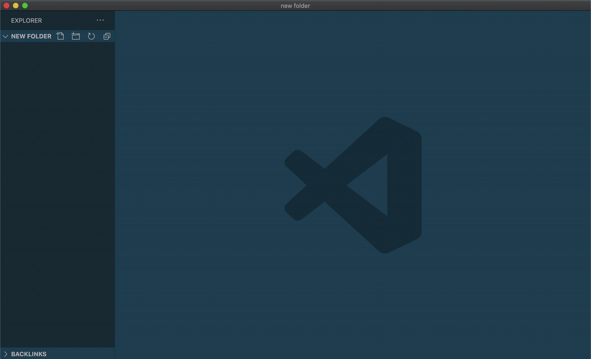
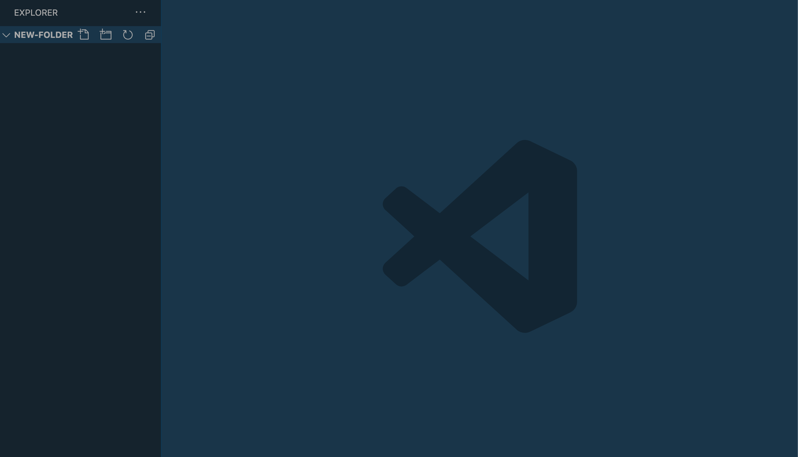
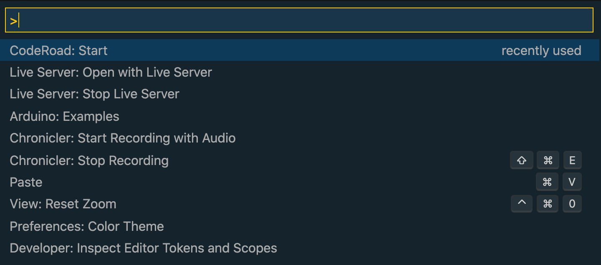
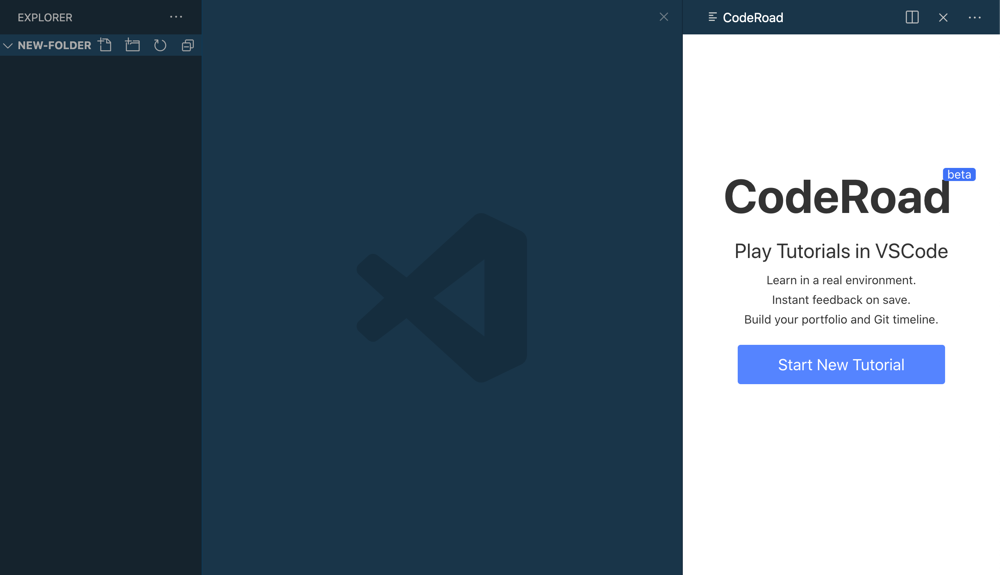
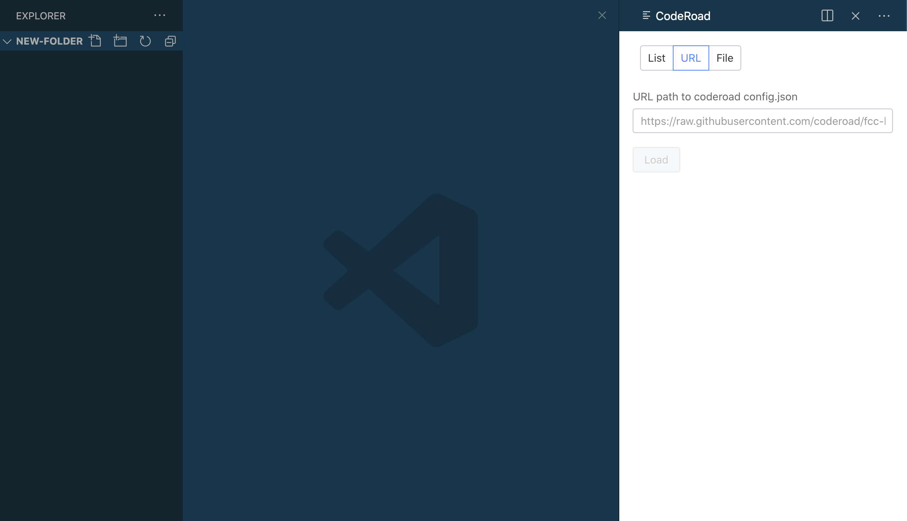

# Learn within VSCode

> **No need to clone.** This repo compiles the tutorial.

## Requirements

  - [CodeRoad Extension for VS Code](https://marketplace.visualstudio.com/items?itemName=CodeRoad.coderoad)
  - `https://raw.githubusercontent.com/iandoyle/code-tutorial-template/master/tutorial.json`

### Follow these steps
  - Create and Open a new folder
    
  - Open command palette. (Windows: `Ctrl+Shift+P` || OSX: `Cmd+Shift+P`)
    - Select: 'CodeRoad: Start'
      
  - Window appears. Click `Start New Tutorial`
    
  - Select URL
    
  - Paste Link
  `https://raw.githubusercontent.com/iandoyle/code-tutorial-template/master/tutorial.json`
  - Click Load
